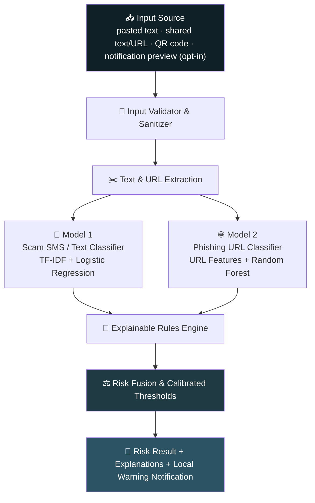

<div align="center">


<br/>

[](#)
[](#)
[](#)
[](#)
[](#)
[](#license)

<br/>

**A privacy-aware Android app that analyzes suspicious messages and links, explains *why* they look risky, and helps you verify before you act — not another alarmist blocker.**

<a href="#-features">Features</a> •
<a href="#-how-it-works">How It Works</a> •
<a href="#-tech-stack">Tech Stack</a> •
<a href="#-getting-started">Getting Started</a> •
<a href="#-api-reference">API</a> •
<a href="#-roadmap">Roadmap</a> •
<a href="#-privacy--safety">Privacy</a>

</div>

<br/>

---

## 📖 Table of Contents

- [Why LinkSentry](#-why-linksentry)
- [Features](#-features)
- [Product Vision](#-product-vision)
- [Who It's For](#-who-its-for)
- [How It Works](#-how-it-works)
  - [Architecture](#architecture)
  - [Model 1 — Scam Text Classifier](#model-1--scam-sms--message-classifier)
  - [Model 2 — Phishing URL Classifier](#model-2--phishing-url-classifier)
  - [Explainable Rules Engine](#explainable-rules-engine)
  - [Risk Fusion](#risk-fusion)
- [Risk Levels](#-risk-levels)
- [Screens & UX](#-screens--ux)
- [Tech Stack](#-tech-stack)
- [Project Structure](#-project-structure)
- [Getting Started](#-getting-started)
- [API Reference](#-api-reference)
- [Privacy & Safety](#-privacy--safety)
- [Security](#-security)
- [Evaluation & Metrics](#-evaluation--metrics)
- [Roadmap](#-roadmap)
- [Limitations & Disclaimer](#-limitations--disclaimer)
- [Team](#-team)
- [Contributing](#-contributing)
- [License](#-license)

---

## 🎯 Why LinkSentry

> Fraudulent messages impersonating banks, police, telecom providers, delivery services, and government departments are everywhere. They use **urgency, fear, fake KYC requests, OTP theft, and phishing links** to pressure people into unsafe actions — and a warning without an explanation is easy to ignore.

**LinkSentry** pauses that moment. Paste a message, share a link, or scan a QR code — and get a clear, explainable risk assessment *before* you click, pay, or share a credential.

<div align="center">

| ❌ Without LinkSentry | ✅ With LinkSentry |
|---|---|
| "Looks legit, I guess?" | "⚠️ High risk — OTP request + brand/domain mismatch" |
| Click first, regret later | Verify independently, first |
| Generic spam label, no context | Plain-language reasons + safe next action |
| Silence on privacy | Manual-first, opt-in only, minimal storage |

</div>

---

## ✨ Features

<table>
<tr>
<td width="50%" valign="top">

### 🔍 Detection
- 📩 **Scam message detection** — fake KYC, OTP theft, payment fraud, impersonation, digital-arrest threats, courier & telecom scams, remote-access scams
- 🔗 **Phishing URL detection** — brand/domain mismatch, suspicious structure, IP-address hosts, punycode, shorteners
- 📷 **QR code scanning** — decode & analyze *before* navigating anywhere
- 🧠 **Two ML models + rules engine** working together, not in isolation

</td>
<td width="50%" valign="top">

### 🛡️ Trust & Control
- 🧾 **Explainable results** — every risk score comes with plain-language reasons
- 🔔 **Optional live protection** — opt-in notification-preview scanning, per-app
- 🗑️ **Local, deletable scan history** — opt-in, no raw content stored by default
- 🕊️ **Calm tone by design** — no "guaranteed," no "criminal," no scare tactics

</td>
</tr>
</table>

### Core Capabilities at a Glance

```text
📋 Paste-to-scan text          🔗 Paste-to-scan URL
📤 Share-to-LinkSentry         📷 QR-code URL scanning
🤖 Dual ML model pipeline      📐 Explainable rules engine
🚦 4-tier risk result screen   🔕 Local warning notifications
👁️ Optional notification watch  🗂️ Local, deletable scan history
```

---

## 🌱 Product Vision

> *"Help Android users pause, understand risk, and verify independently before acting on a suspicious message or link."*

LinkSentry is designed to feel like a **calm safety assistant**, not an alarmist blocker. It explains uncertainty honestly, protects privacy by default, and reserves strong warnings for when multiple high-risk signals genuinely agree.

---

## 👥 Who It's For

| Persona | Profile | What They Need |
|---|---|---|
| 🧑 **Cautious Android User** | Uses SMS, UPI, banking apps, QR codes daily | A quick, jargon-free answer *before* opening a link |
| 👨‍👩‍👧 **Family Safety Helper** | Helps parents/grandparents spot scams | Simple categories, easy-to-read explanations, shareable history |
| 🎓 **Student / Demo Evaluator** | Faculty reviewer, cybersecurity evaluator | Transparent models, honest metrics, documented limitations |

---

## ⚙️ How It Works

### Architecture



### Model 1 — Scam SMS / Message Classifier

Analyzes SMS text, notification previews, shared/pasted text, and (future) OCR text using **TF-IDF word + character n-grams and Logistic Regression**.

<details>
<summary><strong>📂 Scam categories detected</strong></summary>

```text
fake_kyc                     otp_theft
banking_phishing             upi_payment_scam
courier_delivery_scam        telecom_scam
government_impersonation     digital_arrest_scam
remote_access_scam           job_lottery_investment_scam
other_scam
```
</details>

<details>
<summary><strong>✅ Legitimate categories recognized</strong></summary>

```text
safe_transactional     safe_otp_delivery       safe_bank_alert
safe_delivery_update   safe_bill_or_recharge   safe_promotional
safe_personal_message
```
</details>

### Model 2 — Phishing URL Classifier

Parses URLs **without ever opening them**, extracting lexical & structural features, then classifies with a **Random Forest** model.

```text
✔ URL / hostname / domain length        ✔ IP-address host detection
✔ digits · dots · hyphens · @ · %       ✔ punycode / IDN detection
✔ subdomain count & path depth          ✔ URL-shortener detection
✔ HTTP vs HTTPS indicator               ✔ suspicious terms: login, verify, kyc, secure...
✔ entropy / randomness indicators       ✔ claimed brand vs. registered-domain mismatch
```

### Explainable Rules Engine

Transparent, additive scoring for high-confidence signals — no single weak signal ever triggers a strong warning on its own.

| Signal | Weight |
|---|---:|
| Requests OTP, PIN, CVV, password, or UPI PIN | **+35** |
| Requests installing remote-access software | **+30** |
| Threatens account blocking / SIM deactivation / arrest | **+20** |
| Urgency combined with a payment request | **+15** |
| Suspicious URL present | **+15** |
| Claimed brand ≠ registered domain | **+20** |
| URL host is a raw IP address | **+25** |
| URL uses `@` symbol deception | **+20** |

### Risk Fusion

```math
R = 0.45·T + 0.35·U + 0.20·H
```

Where **T** = text-model score, **U** = URL-model score (reweighted if no URL present), **H** = normalized rule-engine score. Weights are **tuned on validation data**, never assumed.

> 🔺 **Critical escalation** to the highest severity requires `final risk ≥ 0.85` **AND** at least one critical indicator (credential/OTP request, remote-access request, brand/domain mismatch + lure, or threat + urgency) — never score alone.

---

## 🚦 Risk Levels

<div align="center">

| Score | Level | Behavior |
|:---:|:---|:---|
| 🟢 `0–29` | **Low risk** | Calm, informational — no high-priority alert |
| 🟡 `30–59` | **Verify independently** | Soft caution + safe verification guidance |
| 🟠 `60–79` | **Suspicious** | Strong caution — advises against using included links |
| 🔴 `80–100` | **High risk** | Prominent warning + immediate safety actions |

</div>

---

## 📱 Screens & UX

| Screen | Purpose |
|---|---|
| **Onboarding** | Explains what LinkSentry does, its limits, and privacy stance up front |
| **Home** | Quick actions — paste text, paste URL, scan QR, view history |
| **Manual Scan** | Large text field + URL input, extracts links automatically |
| **Result** | Risk level, score, plain-language reasons, detected URLs, safe next action, feedback control |
| **Settings** | Notification-monitoring opt-in/out, per-app selection, history controls |
| **History** | Timestamp, category, score, reasons — deletable per-entry or in bulk |

**Tone guide:**

```diff
+ "Potential phishing attempt"
+ "Suspicious message detected"
+ "Verify independently before acting"
- "This sender is a criminal"
- "Guaranteed protection"
- "100% scam detection"
```

---

## 🧰 Tech Stack

<div align="center">

### 📲 Mobile


### ☁️ Backend


</div>

| Layer | Technology |
|---|---|
| Mobile UI | Flutter |
| Native Android integration | Kotlin |
| Notification monitoring | Android `NotificationListenerService` |
| Share target | Android intent filters / Flutter platform integration |
| QR scanning | Flutter barcode/QR scanner package |
| Local storage | SQLite / Hive / encrypted local storage |
| Local notifications | Flutter local-notifications package |
| API | Python FastAPI |
| Text ML | scikit-learn · TF-IDF · Logistic Regression |
| URL ML | scikit-learn · handcrafted features · Random Forest |
| Model serialization | joblib / pickle, versioned |
| Data validation | Pydantic |
| Testing | pytest, Postman/Bruno, integration tests |
| Optional database | Firebase Firestore or PostgreSQL (only if needed) |

---

## 🗂️ Project Structure

```text
linksentry/
├── mobile/                      # Flutter Android app
│   ├── lib/
│   │   ├── screens/              # Onboarding, Home, Scan, Result, Settings, History
│   │   ├── services/             # API client, share intent, QR scanner
│   │   ├── storage/               # Local scan history (opt-in)
│   │   └── native/                # Kotlin notification-listener bridge
│   └── android/
├── backend/                      # FastAPI service
│   ├── app/
│   │   ├── api/                   # /analyze/text, /analyze/url, /analyze/combined, /analyze/qr
│   │   ├── models/                 # Model 1 (text) + Model 2 (URL) artifacts & loaders
│   │   ├── rules/                   # Explainable rules engine
│   │   ├── fusion/                   # Risk fusion & calibrated thresholds
│   │   └── schemas/                   # Pydantic request/response models
│   └── tests/
├── ml/
│   ├── datasets/                 # Sample/anonymized data only
│   ├── notebooks/                 # Training & evaluation
│   └── evaluation/                 # Metrics reports, confusion matrices
└── docs/                          # PRD, architecture diagrams, privacy disclosures
```

---

## 🚀 Getting Started

### Prerequisites

```text
Flutter SDK 3.x+        Python 3.10+
Android SDK              pip / venv
Android device or emulator (API 24+ recommended)
```

### 1️⃣ Backend Setup

```bash
cd backend
python -m venv venv
source venv/bin/activate        # Windows: venv\Scripts\activate
pip install -r requirements.txt
uvicorn app.main:app --reload --port 8000
```

### 2️⃣ Train / Load Models (first run)

```bash
cd ml
python train_text_model.py      # Model 1: TF-IDF + Logistic Regression
python train_url_model.py       # Model 2: URL features + Random Forest
```

### 3️⃣ Mobile App Setup

```bash
cd mobile
flutter pub get
flutter run   # select a connected device or emulator
```

### 4️⃣ Point the App at Your Backend

```text
Update the API base URL in mobile/lib/services/api_config.dart
to your local machine's IP address (e.g., http://192.168.x.x:8000)
```

---

## 🔌 API Reference

| Endpoint | Method | Purpose |
|---|:---:|---|
| `/api/analyze/text` | `POST` | Analyze message text only |
| `/api/analyze/url` | `POST` | Analyze a single URL only |
| `/api/analyze/combined` | `POST` | Analyze text + extracted URL(s) together |
| `/api/analyze/qr` | `POST` | Analyze a URL decoded from a QR code |
| `/api/feedback` | `POST` | Submit optional, masked user feedback |
| `/api/health` | `GET` | Service health check |
| `/api/model-info` | `GET` | Current model versions |

<details>
<summary><strong>▶️ Example request — <code>POST /api/analyze/combined</code></strong></summary>

```json
{
  "text": "Your account will be blocked today. Update KYC immediately: http://bank-verify.example",
  "urls": ["http://bank-verify.example"],
  "source": "manual_paste",
  "language_hint": "en"
}
```
</details>

<details>
<summary><strong>◀️ Example response</strong></summary>

```json
{
  "final_risk_score": 91,
  "final_risk_level": "high_risk",
  "text_analysis": {
    "score": 88,
    "category": "fake_kyc",
    "findings": ["Account-blocking threat", "Urgent KYC request"]
  },
  "url_analysis": [
    {
      "url": "http://bank-verify.example",
      "score": 91,
      "classification": "phishing",
      "registered_domain": "bank-verify.example",
      "findings": ["Suspicious URL structure", "Brand/domain mismatch"]
    }
  ],
  "rules_triggered": ["account_blocking_threat", "suspicious_url"],
  "recommended_action": "Do not open the link or share credentials. Verify through the official app or a manually typed official website."
}
```
</details>

---

## 🔒 Privacy & Safety

<table>
<tr>
<td width="50%" valign="top">

**Core principles**
- 🖐️ Manual scan is the default experience
- 🔕 Notification access is opt-in, per-app, and clearly explained
- 🗑️ Raw message content is **not stored by default**
- 🧽 Sensitive data (OTP, PIN, CVV) is masked before any upload

</td>
<td width="50%" valign="top">

**User controls**
- ✅ Enable/disable monitoring at any time
- 🗑️ Delete a single history entry or wipe all history
- 📤 Feedback is optional and never auto-retrains live models
- 🔍 Transparent disclosure of what is/isn't stored

</td>
</tr>
</table>

---

## 🛡️ Security

```text
✔ HTTPS for all backend communication
✔ Input validation on every mobile & API entry point
✔ Rate-limited public analysis endpoints
✔ No raw sensitive content in logs
✔ Secrets via environment variables — never committed to Git
✔ URLs are analyzed as strings only — never fetched, rendered, or executed
```

---

## 📊 Evaluation & Metrics

LinkSentry's models are evaluated using **precision, recall, F1-score, and confusion matrices**, with explicit false-positive and false-negative reduction policies — because a security tool that cries wolf gets ignored, and one that misses real threats defeats its own purpose.

> 📌 All reported metrics come from actual measured evaluation runs. Placeholder or assumed numbers are never presented as final results.

---

## 🗺️ Roadmap

- [x] Model 1 & Model 2 baseline training + evaluation
- [x] FastAPI backend with combined risk fusion
- [x] Flutter MVP — paste scan, share-to-app, QR scan, local history
- [ ] Optional Kotlin notification-listener live protection
- [ ] 📸 Screenshot OCR for scam-image text
- [ ] 🌐 Multilingual & regional-language support
- [ ] 🔗 Safe in-app URL preview
- [ ] 🧩 Controlled shortened-link expansion
- [ ] 📇 Official-domain registry management
- [ ] 📴 On-device model inference
- [ ] 🌍 Trusted threat-intelligence / reputation lookup
- [ ] 🖥️ Chrome / desktop browser extension
- [ ] 👨‍👩‍👧‍👦 Family / caregiver mode

---

## ⚠️ Limitations & Disclaimer

> LinkSentry analyzes patterns that **may indicate** scams or phishing. Its results are **risk assessments, not proof**. It cannot monitor every message or block every link across all apps, and notification analysis depends on the preview content Android makes available.
>
> **Never share your OTP, PIN, password, CVV, or UPI PIN with anyone — including in response to any warning from this app.** Always verify suspicious requests through official apps or manually typed, known websites.

---

## 🧑‍🤝‍🧑 Team

| Role | Responsibilities |
|---|---|
| 📱 Mobile Developer | Flutter UI, share target, QR scanner, local history, notifications, Kotlin integration |
| 🤖 ML / Data Developer | Dataset curation, labeling, Model 1 & 2, calibration, evaluation reports |
| ⚙️ Backend Developer | FastAPI, model serving, risk fusion, API security, logging controls |
| 🔐 Security / QA / Docs | Rules engine, test cases, privacy review, permission flow, documentation |

---

## 🤝 Contributing

Contributions, issue reports, and dataset suggestions are welcome. Please open an issue to discuss significant changes before submitting a pull request, and keep any new detection signal or dataset addition consistent with the project's calm, explainable, privacy-first tone.

---

## 📄 License

Distributed under the **MIT License**. See `LICENSE` for details.

---

<div align="center">


**LinkSentry** — *Think before you tap.* 🛡️

</div>
